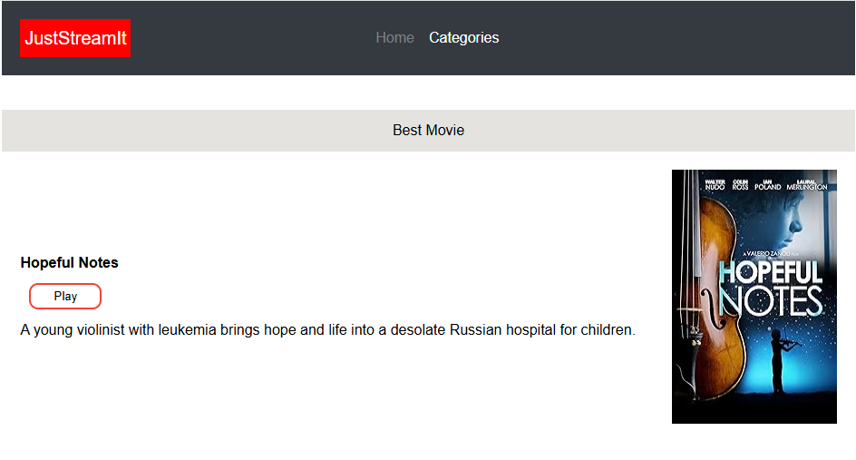
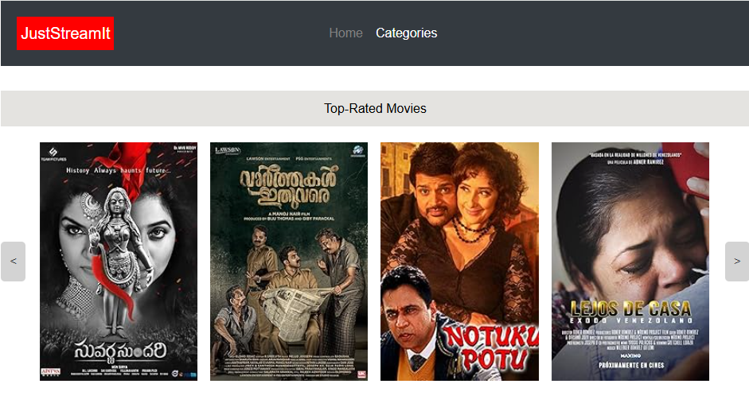

# Develop a User Interface for a Python Web Application

**OpenClassrooms - Python Developer Path:** Project 6

**Student:** Abdoul Baki Seydou

**Date:** 01/02/2023 

## Table of Contents
1. [Summary](#summary)
2. [Features](#features)
3. [Technologies Used](#technologies-used)
4. [Project Tasks](#project-tasks)
5. [Local Development](#local-development)
   - [Prerequisites](#prerequisites)
   - [Setup on macOS/Linux](#setup-on-macoslinux)
   - [Setup on Windows](#setup-on-windows)
   - [Running the Application](#running-the-application)
   - [Screenshots](#screenshots)

## Summary
This project consists of creating for a client, JustStreamIt, a website written in HTML, 
CSS and Vanilla Javascript without any other framework, to visualise featured movie's data.

The data is fetched from a local version of a home-made API named [OCMovies-API-EN-FR](https://github.com/OpenClassrooms-Student-Center/OCMovies-API-EN-FR).

## Features
1. **Best Movie:** Display the with the highest IMDb rating.
2. **Top-Rated Movies:** Display the seven Top-rated movies in all categories.
3. **Category Top-Rated Movies:** Display the seven Top-rated movies of Biography, Comedy and History.
4. **Cover image:** A movie in a category is represented by its cover image.
5. **Modal:** Clicking on a featured movie’s image opens a modal window displaying its details.

## Technologies Used
- **Programming Languages:** Python, Javascript, HTML, CSS.
- **Database:** SQLite.

## Project Tasks
1. Create an index page in HTML/CSS of the mock-up provided.
2. Create javascript files linked to the index.html, fetching and displaying the data.

## Local Development

### Prerequisites
- Python 3.6 or higher.

### Setup on macOS/Linux

1. **Clone the Repository**
   ```bash
   cd /path/to/put/project/in
   git clone https://github.com/Afudu/P6_OpenClassroom.git

2. **Move to the folder**
   ```bash
   cd P6_OpenClassroom

3. **Set Up Virtual Environment**
   ```bash
   python -m venv venv
   
4. **Activate Environment**
   ```bash
   source venv/bin/activate 

   
7. **To deactivate Environment**
   ```bash
   deactivate

### Setup on Windows

1. Follow the steps above.

2. To activate the environment:
   ```bash
   venv\Scripts\Activate

### Running the application

1. Fetch the data repository:
   ```bash
   git clone https://github.com/OpenClassrooms-Student-Center/OCMovies-API-EN-FR.git

2. Move to the Data Repository and then Start the server:
   ```bash
   cd OCMovies-API-EN-FR && python manage.py runserver
  
3. With the server running, open in your favorite web browser the file ```index.html``` located in the 
```P6_OpenClassroom``` directory.
   ```bash
   index.html

## Screenshots





